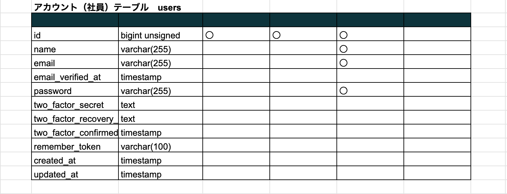
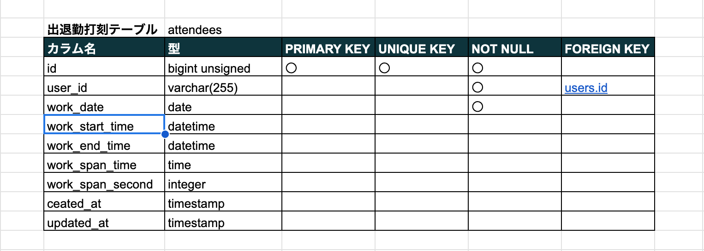
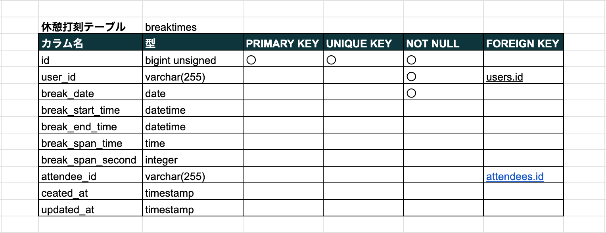
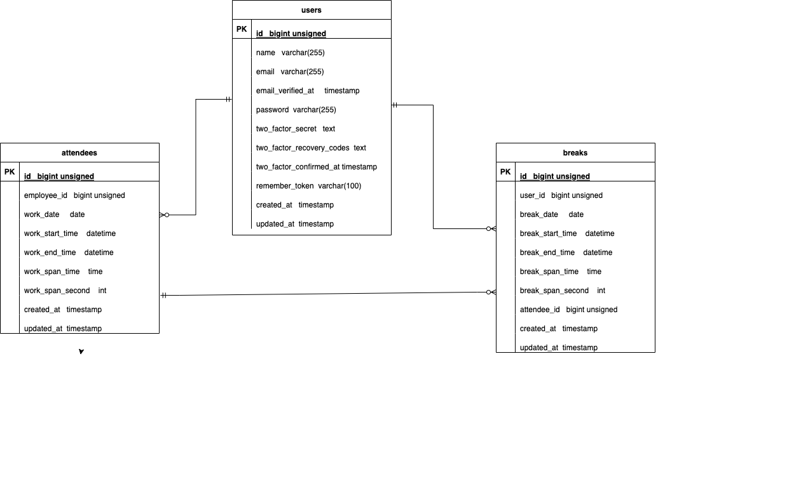

## アプリケーション名

勤怠管理システム


## 作成した目的

各社員が勤務開始、休憩開始、休憩終了、勤務終了ボタンを押下。  
社員毎の勤務時間を日付毎に管理できるようにする

## アプリケーション URL

- 打刻画面 http://localhost/
- 日付別集計画面 http://localhost/sumsearch
- 会員登録画面 http://localhost/register

## 他のレポジトリー

## 機能一覧

- 会員登録
- ログイン
- ログアウト
- 勤務開始
- 勤務終了
- 休憩開始
- 休憩終了
- 日付別集計画面
- ページネーション

## 使用技術(実行環境)

- PHP 7.4.9
- Laravel Framework 8.83.8
- MySQL 8.0.26
- phpmyadmin 5.2.1

## テーブル設計







## ER 図



## 環境構築

**Docker ビルド**

$ `cd coachtech/laravel`

$ `git clone git@github.com:coachtech-material/`

$ `laravel-docker-template.git`

$ `mv laravel-docker-template [attendannce1]`  
※[attendannce1]は任意のフォルダ名

DockerDesktop アプリを立ち上げる

$ `docker-compose up -d --build`

開発の履歴を残すために、個人個人のリモートリポジトリの url を変更します。
[attendannce1]名のリポジトリ―を GITHUB にて作成

ターミナルより以下コマンドで　ローカルリポジトリのデータをリモートリポジトリに反映  
$ `git add .`

$ `git commit -m "リモートリポジトリの変更"`

$ `git push origin main`

**LARAVEL 環境構築**

①$ `docker-compose exec php bash`

②$ `composer install`

③ 「.env.example」ファイルを 「.env」ファイルに命名を変更  
 または、新しく.env ファイルを作成  
④ .env に以下の環境変数を追加

```
DB_CONNECTION=mysql
DB_HOST=mysql
DB_PORT=3306
DB_DATABASE=laravel_db
DB_USERNAME=laravel_user
DB_PASSWORD=laravel_pass
```

⑤ アプリケーションキーの作成  
$ `docker-compose exec php bash`

$ `php artisan key:generate`

⑥ マイグレーションの実行  
$ `docker-compose exec php bash`

$ `php artisan migrate`

⑦ シーディングの実行(ユーザマスタのみ)  
$ `docker-compose exec php bash`

$ `php artisan db:seed`

ログイン初期パスワードは全て password

## 他に記載することがあれば記載する
